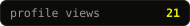
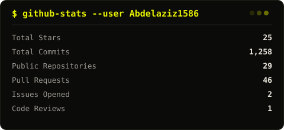
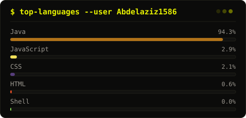
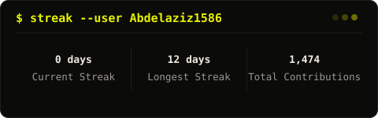

<!-- ══════════════════════════════════════════════════════════ -->
<!--                       HEADER                             -->
<!-- ══════════════════════════════════════════════════════════ -->
<div align="center">

[](https://git.io/typing-svg)

<br/>

<a href="https://abdelaziz1586.github.io">
  
</a>
<a href="mailto:abdelaziz.hasaneen@merakistudios.dev">
  
</a>
<a href="https://github.com/Abdelaziz1586">
  
</a>

<br/><br/>



</div>

<br/>

<!-- ══════════════════════════════════════════════════════════ -->
<!--                       ABOUT                              -->
<!-- ══════════════════════════════════════════════════════════ -->

```
╔═══════════════════════════════════════════════════════╗
║  $ whoami                                             ║
║                                                       ║
║  > Developer @ Meraki Studios                         ║
║  > Specializing in backend systems & server infra     ║
║  > Minecraft plugin dev & server optimization         ║
║  > Discord bot & API architecture                     ║
║  > Open-source contributor                            ║
╚═══════════════════════════════════════════════════════╝
```

<div align="center">
  <sub>▬▬▬▬▬▬▬▬▬▬▬▬▬▬▬▬▬▬▬▬▬▬▬▬▬▬▬▬▬▬▬▬▬▬▬▬▬▬▬▬▬▬▬▬▬▬▬▬▬▬▬▬▬▬▬▬▬</sub>
</div>

<br/>

<!-- ══════════════════════════════════════════════════════════ -->
<!--                    TECH STACK                            -->
<!-- ══════════════════════════════════════════════════════════ -->

<h2 align="center">⚡ Tech Stack</h2>

<h4 align="center">— Languages —</h4>
<p align="center">
  
  
  
  
  
  
  
</p>

<h4 align="center">— Databases —</h4>
<p align="center">
  
  
  
  
</p>

<h4 align="center">— Infrastructure & Tools —</h4>
<p align="center">
  
  
  
  
  
  
</p>

<h4 align="center">— Specializations —</h4>
<p align="center">
  
  
  
  
</p>

<br/>

<!-- ══════════════════════════════════════════════════════════ -->
<!--            GITHUB STATS — SELF-HOSTED, NO PROXY          -->
<!-- ══════════════════════════════════════════════════════════ -->

<h2 align="center">📊 GitHub Stats</h2>

<p align="center"><sub>Generated by a GitHub Action in this repo straight from the GitHub API — no third-party rendering service in the loop.</sub></p>

<div align="center">
  
</div>

<br/>

<div align="center">
  
</div>

<br/>

<div align="center">
  
</div>

<br/>

<h2 align="center">📈 Contribution Snake</h2>

<div align="center">
  <picture>
    <source media="(prefers-color-scheme: dark)" srcset="./assets/snake-dark.svg"/>
    
  </picture>
</div>

<br/>

<!-- ══════════════════════════════════════════════════════════ -->
<!--                     FOOTER                               -->
<!-- ══════════════════════════════════════════════════════════ -->

<div align="center">
  
</div>
